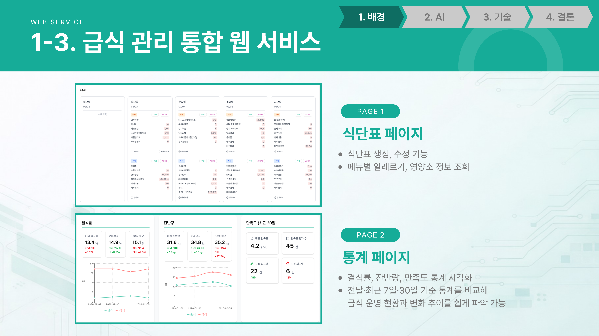
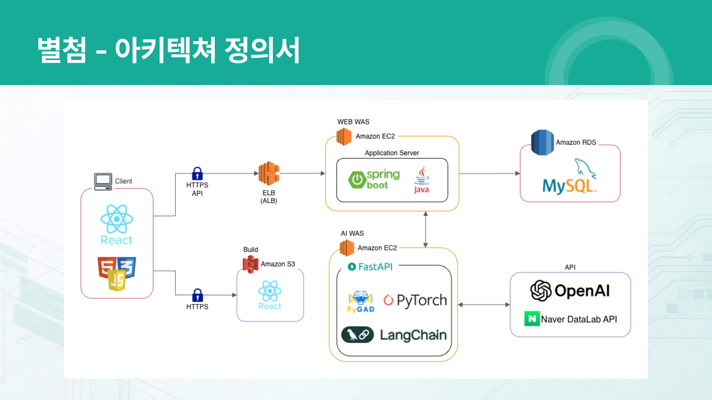
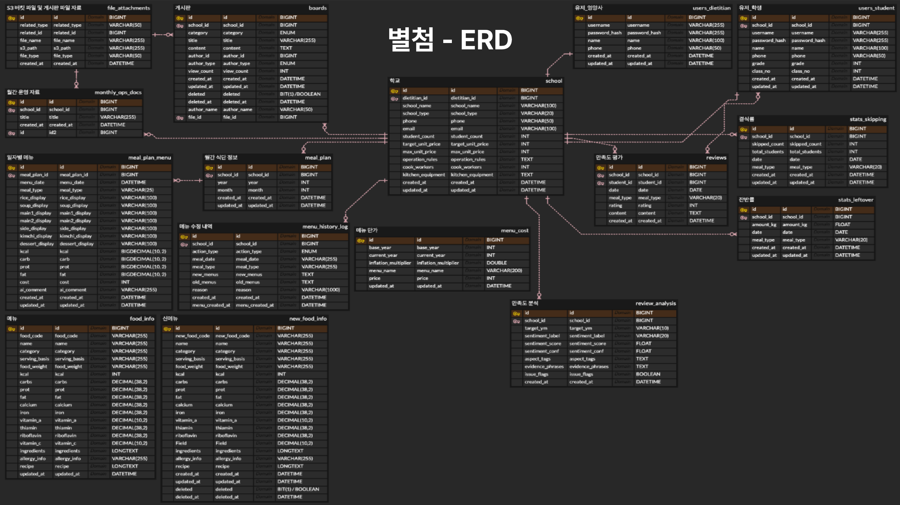
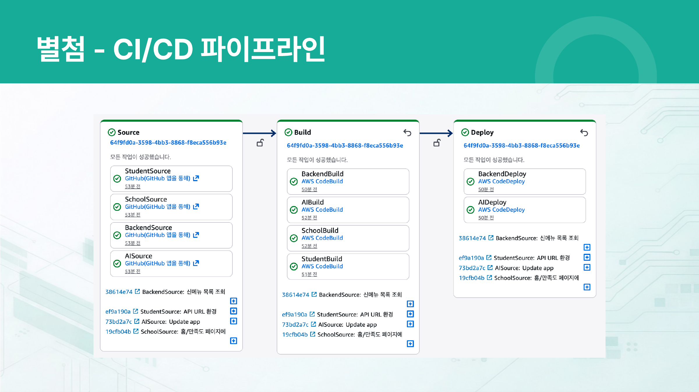
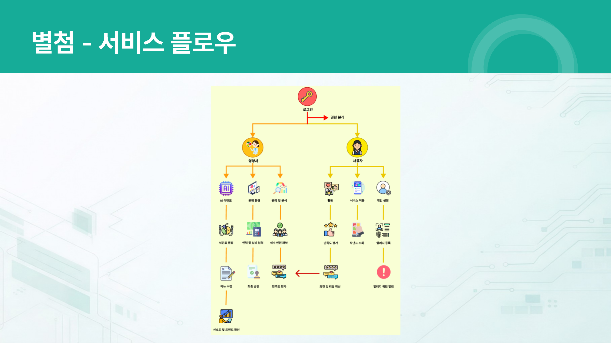
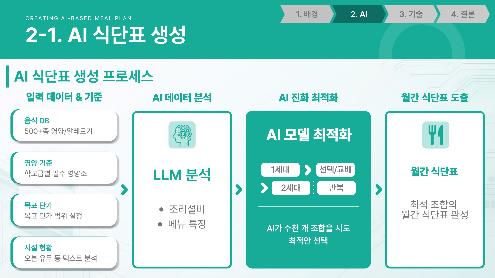
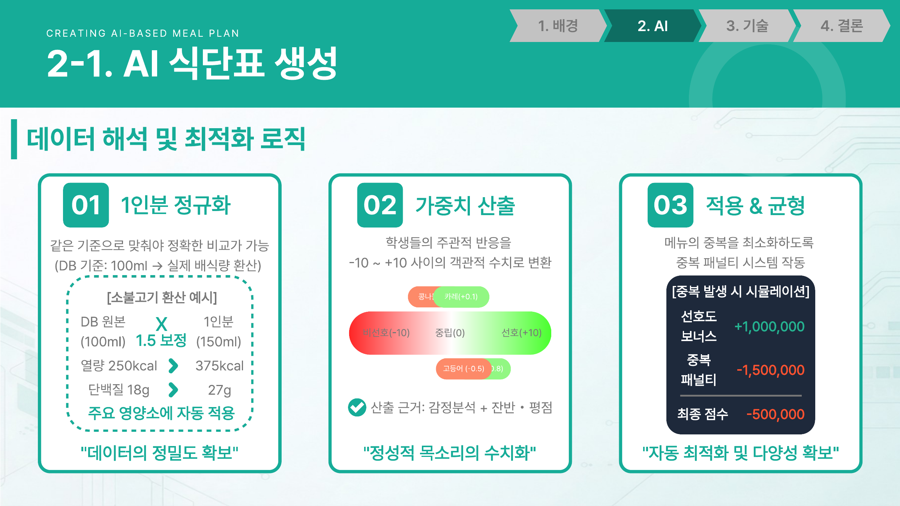
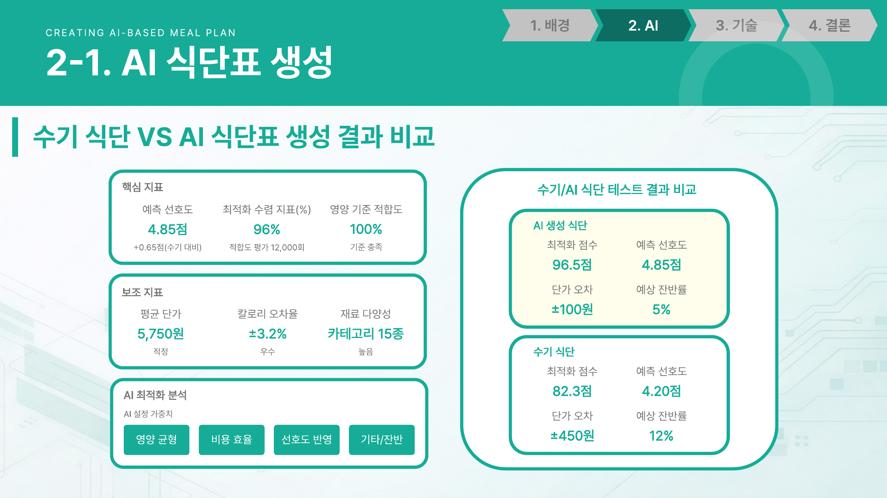
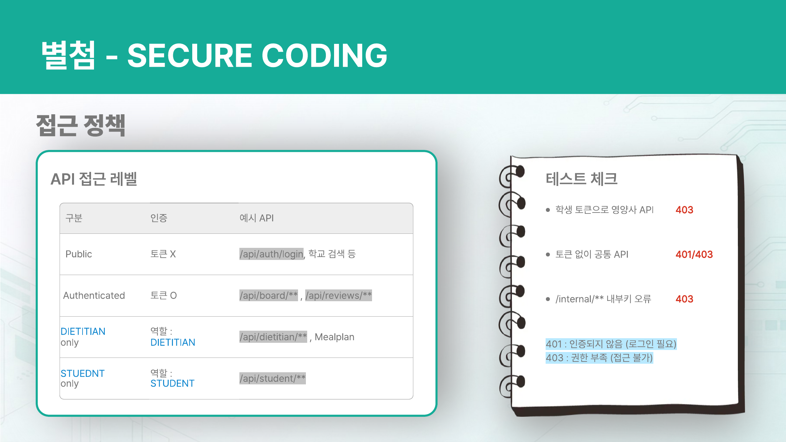

# NutriAssistant — AI 기반 급식 운영 자동화 시스템

학교 급식 영양사의 식단 작성, 예산 산정, 영양 기준 준수, 학생 피드백 반영을 데이터와 AI로 보조하는 시스템입니다.

- **과정** KT AIVLE School 8기 10반 18조 빅프로젝트
- **기간** 2025.12.29 ~ 2026.02.20
- **팀 구성** 6명 (Backend 3, Frontend 3)
- **본인 담당** AI 식단표 생성의 AI 파트 및 백엔드

> 팀 프로젝트이며, 팀 합의 하에 포트폴리오 목적으로 개인 계정에도 게시합니다.

---

## 저장소 구성

| 대상 | 링크 |
|------|------|
| Backend (Spring Boot) | https://github.com/totorosi/NutriAssistant-Back |
| AI Service (FastAPI) | https://github.com/totorosi/NutriAssistant-AI |
| 영양사 Front-End | https://github.com/totorosi/smart-meal-nutritionist-web |
| 학생 Front-End | https://github.com/totorosi/User-Front-End-Github-Repository |

---

## 1. 배경

영양사를 대상으로 한 설문에서 '식단 작성 시 어려운 점'으로 꼽힌 응답 비율입니다.

| 항목 | 비율 |
|------|------|
| 학생 기호도 반영 | 18.6% |
| 영양소와 에너지 균형 | 17.2% |
| 예산 내 식단 구성 | 16.9% |
| 조리 인력 고려 | 12.7% |
| 알레르기 파악 및 반영 | 7.3% |

어느 하나를 만족시키는 문제가 아니라 **여러 제약을 동시에 만족시켜야 하는 문제**입니다. 그래서 현장은 과거 식단(17.3%)과 인터넷 검색(19.4%)에 의존하게 되고, 알레르기 검증 누락이나 영양 균형 재확인 어려움이 따라옵니다.

> 출처: 계층적 분석과정을 적용한 학교급식 식단 구성의 중요도 분석

---

## 2. 주요 서비스

| 서비스 | 내용 |
|--------|------|
| AI 기반 식단표 작성 | 유전 알고리즘으로 최적 조합 도출, 학교급별 8대 필수 영양소 기준 자동 준수, LLM으로 조리 시설 분석 및 메뉴 가중치 반영 |
| 운영 데이터 실시간 분석 | 네이버 쇼핑 인사이트 연동 푸드 트렌드 수집, 트렌드 기반 신메뉴 후보군 및 레시피 생성, 학생 만족도 감성 분석 |
| 지능형 월간 리포트 생성 | LangChain 기반 리포트 파이프라인, 만족도 지표 및 잔반율 추이 자동 산출, 자연어 컨설팅 리포트 |

### 웹 서비스 구성

| 페이지 | 기능 |
|--------|------|
| 식단표 | 식단표 생성·수정, 메뉴별 알레르기·영양소 정보 조회 |
| 통계 | 결식률·잔반량·만족도 시각화, 전날/최근 7일/30일 비교 |
| 월간 운영 자료 | 월간 리포트 자동 생성 및 다운로드 |



---

## 3. 시스템 아키텍처



```
Client (React / TypeScript)
  ├─ HTTPS → S3            정적 호스팅 (빌드 산출물)
  └─ HTTPS → ALB → EC2     Spring Boot (Application Server) → RDS MySQL
                              ↕
                           EC2  FastAPI (AI Service)
                              ↕
                           OpenAI API · Naver DataLab API
```

Spring Boot 백엔드가 요청을 받고, LLM과 최적화 연산이 필요한 요청만 FastAPI AI 서비스로 전달하는 구조입니다.

### ERD



### CI/CD



AWS CodePipeline으로 저장소 4개(Backend, AI, 영양사 Front, 학생 Front)의 소스를 감지해 CodeBuild에서 병렬 빌드하고 CodeDeploy로 배포합니다.

### 서비스 플로우



---

## 4. AI 식단표 생성 (본인 담당 파트)

식단표 생성 기능은 2인이 담당했습니다. 역할을 고정해 나누기보다 상대가 손대지 않은 영역을 서로 메우는 방식으로 진행했고, 본인은 **AI 파트(전처리 · 가중치 설계 · 알고리즘 선정)와 백엔드**를 담당했습니다.



### 4-1. 알고리즘 선정

영양 기준, 목표 단가, 메뉴 중복, 학생 선호도를 **동시에** 만족시켜야 하는 문제입니다.

| 방식 | 한계 |
|------|------|
| 규칙 기반 | 복합 제약(영양 + 단가 + 선호도)을 동시에 최적화하지 못함 |
| LLM 단독 | 존재하지 않는 메뉴 생성, 영양·단가 계산 오류 |

유전 알고리즘(PyGAD)을 대안으로 제안했고, 초기에는 팀이 회의적이었습니다. 프로토타입으로 결과를 확인시킨 뒤 핵심 기술로 채택되었습니다.

최종 구조는 **비정형 데이터 처리는 LLM, 복합 제약 해결은 유전 알고리즘**이 담당하는 형태입니다. 고등학생 영양 기준을 hard constraint로 두고, LLM이 산출한 선호도 가중치를 적합도 함수에 합산합니다.

### 4-2. 전처리 — 1인분 정규화

음식 DB는 100ml 기준이라 실제 배식량과 맞지 않아, 같은 기준으로 비교할 수 없었습니다. 실제 배식량으로 환산하는 정규화를 적용했습니다.

```
소불고기 예시
  DB 원본 100ml  ×  1.5 보정  →  1인분 150ml
  열량  250kcal  →  375kcal
  단백질   18g   →     27g
```

주요 영양소 전체에 자동 적용됩니다.

### 4-3. 가중치 설계 — 정성 데이터의 수치화

학생들의 주관적 반응을 비교 가능한 값으로 바꿔야 적합도 함수에 넣을 수 있습니다. 감성분석 결과, 잔반량, 평점을 근거로 **-10 ~ +10** 구간의 선호도 점수를 산출했습니다.

```
비선호(-10)  ←──  중립(0)  ──→  선호(+10)
  고등어(-0.5)          카레(+0.1)
```

### 4-4. 적합도 함수

제약의 성격에 따라 패널티 크기를 다르게 설계했습니다.

| 항목 | 처리 |
|------|------|
| 단가 상한 초과 | hard constraint. `2,000,000 + 초과액 × 10,000` |
| 목표 단가 허용 범위 내 | 보너스 `+150,000` |
| 목표 단가 허용 범위 초과 | `초과 정도 × 500` |
| 메뉴 중복 | 패널티 `-1,500,000` |
| 선호도 | 보너스 `+1,000,000` |
| 영양소 기준 충족 | 보너스 `+200,000` |
| 영양소 기준 미달 | `100,000 + 편차 × 200` |

중복 패널티를 선호도 보너스보다 크게 두어, 선호도가 높은 메뉴가 반복 등장하는 문제를 막았습니다. 다만 **쌀밥과 김치는 매일 나와야 하므로 중복 예외** 처리했고, 메뉴 재등장은 **Cool-time 4~9일 랜덤**으로 제어했습니다.



### 4-5. 데이터 무결성

| 항목 | 처리 |
|------|------|
| 중복 저장 차단 | `학교ID + 날짜 + 식사유형` 복합 유니크 제약으로 DB 레벨에서 강제 |
| 트랜잭션 | 식단 생성 중 오류 시 부분 저장 없이 롤백 |
| 변경 이력 | Action Type으로 'AI 자동 대체'와 '영양사 수동 수정'을 구분 저장 |
| 부분 수정 | 식단 전체 재생성이 아니라 특정 날짜의 특정 끼니만 지정 수정 |
| 판단 근거 제공 | AI가 메뉴를 대체한 사유를 함께 반환 |

### 4-6. 테스트 결과



| 지표 | 수기 식단 | AI 식단 |
|------|----------|---------|
| 최적화 점수 | 82.3 | **96.5** |
| 예측 선호도 | 4.20 | **4.85** (+0.65) |
| 단가 오차 | ±450원 | **±100원** |
| 예상 잔반률 | 12% | **5%** |
| 영양 기준 적합도 | — | **100% 충족** |

보조 지표: 평균 단가 5,750원, 칼로리 오차율 ±3.2%, 재료 다양성 카테고리 15종, 적합도 평가 12,000회

> 위 값은 테스트 데이터 기준 비교 결과이며, 실제 학교 운영 데이터로 검증한 수치는 아닙니다.

---

## 5. 백엔드 구현 (본인 담당)

### 5-1. 아키텍처

```
Controller → Service → Repository → MySQL
                ↓
         External Integration
         (FastAPI · NEIS Open API · AWS S3 · Vertex AI)
```

외부 API 호출을 Service 계층에서 통합 관리하고 Request/Response DTO를 분리했습니다.

### 5-2. 주요 구현

| 항목 | 내용 |
|------|------|
| 인증 | JWT Stateless 세션 + 필터 체인. role / 학교 ID Claims 기반 권한 제어 |
| 내부 호출 보호 | `/internal/**` 는 `X-Internal-API-Key` 로 보호 |
| 역할 분리 | DIETITIAN / STUDENT 로 접근 경로 분리 |
| 비밀번호 | BCrypt 단방향 해시. 로그인 시 복호화가 아닌 해시 비교(matches) 방식 |
| 표준 응답 | success / error 구조 통일로 프론트 처리 단순화 |
| DB 설계 | 유니크 제약 및 인덱스, Auditing(createdAt) 적용 |
| 운영 안정성 | `@Scheduled` 배치로 지표 분석·집계 자동화, GlobalExceptionHandler로 예외 중앙 처리 |
| 식단 이미지 생성 | Google Vertex AI Imagen 모델을 호출해 식단 데이터 기반 급식 이미지 생성. 서비스 계정 인증으로 액세스 토큰 발급 |

### 5-3. 접근 정책 검증



| 구분 | 인증 | 예시 API |
|------|------|----------|
| Public | 토큰 불필요 | `/api/auth/login`, 학교 검색 |
| Authenticated | 토큰 필요 | `/api/board/**`, `/api/reviews/**` |
| DIETITIAN only | 역할 DIETITIAN | `/api/dietitian/**`, Mealplan |
| STUDENT only | 역할 STUDENT | `/api/student/**` |

설정만 확인하고 넘기지 않고 실제 호출로 검증했습니다.

- 학생 토큰으로 영양사 API 호출 → **403**
- 토큰 없이 공통 API 호출 → **401 / 403**
- `/internal/**` 내부 키 오류 → **403**

---

## 6. 기술 스택

### Frontend

| 구분 | 스택 |
|------|------|
| Language | TypeScript |
| Framework | React |
| Styling | Tailwind CSS |
| UI Components | shadcn/ui |
| Charts | Recharts |
| Icons | Lucide React |
| Build | Vite |
| Deployment | AWS CodePipeline |

### Backend

| 구분 | 스택 |
|------|------|
| Language | Java |
| Framework | Spring Boot |
| ORM | Spring Data JPA |
| DB | MySQL |
| Security | Spring Security + JWT |
| Build | Gradle |
| Docs | Swagger |
| External | FastAPI, NEIS Open API |
| Cloud | AWS S3, Vertex AI |

### AI Service

| 구분 | 스택 |
|------|------|
| Language | Python |
| Framework | FastAPI |
| 최적화 엔진 | PyGAD |
| LLM | OpenAI GPT |
| LLM 오케스트레이션 | LangChain |
| 머신러닝 | scikit-learn (Random Forest) |
| 데이터 처리 | Pandas, NumPy |
| 데이터 검증 | Pydantic |

### Infra

EC2, S3, RDS(MySQL), ALB, CodePipeline, CodeBuild, CodeDeploy

---

## 7. 데이터

| 데이터 | 형태 | 출처 | 사용 권한 |
|--------|------|------|-----------|
| 음식 DB (`food_info`) | CSV 75KB | 식품영양성분 데이터베이스, 공공급식전산조달시스템 | 이용 허락 범위 재배포 허용 |
| 만족도 (`meal_feedback`) | CSV | 자체 제작 | — |
| 선호도 (`meal_preference`) | CSV | 자체 제작 | — |

---

## 8. 향후 계획

| 항목 | 내용 |
|------|------|
| 잔반량 자동 측정 | AI 잔반량 측정 모델과 연계해 급식 후 식판 이미지를 자동 분석 |
| 카테고리 기반 식단 편성 | 카테고리 제약을 AI 입력으로 활용 |
| 신메뉴 통합 DB 자동 반영 | AI가 생성한 신메뉴를 검증 후 기존 음식 DB에 자동 반영 |

### 기대 효과

| 항목 | 기대치 |
|------|--------|
| 업무시간 단축 | 75% |
| 발주 오류 감소 | 25% |
| 잔반 평균 감소 | 20% |

> 기대 효과는 프로젝트 기획 단계의 목표치이며, 실측값이 아닙니다.
